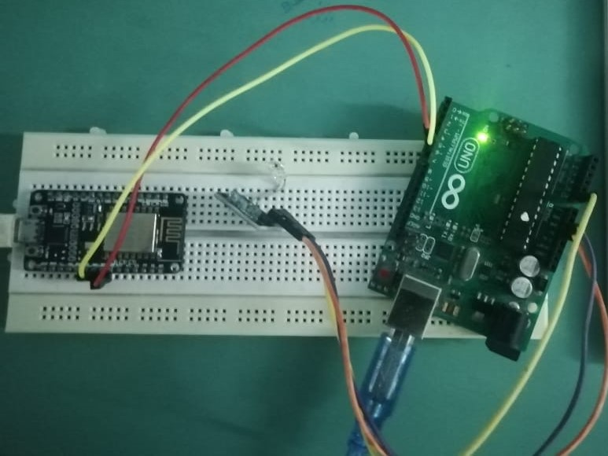

# Healthcare Vitals Monitoring System

An IoT-based healthcare monitoring system that measures patient vital signs (such as pulse rate and temperature) using sensors connected to a microcontroller (NodeMCU/Arduino) and transmits the data to a mobile dashboard using Blynk. The system provides real-time visualization and alert notifications for abnormal readings.

---

## 1. Overview

This project implements a real-time embedded health monitoring prototype designed to:

- Periodically read vital parameters
- Transmit measurements over Wi-Fi
- Display values on a mobile dashboard
- Trigger alerts when thresholds are exceeded

The system is suitable for academic projects, IoT experimentation, and basic remote health monitoring demonstrations.

---

## 2. Features

- Real-time pulse and temperature monitoring  
- Wi-Fi connectivity using NodeMCU (ESP8266)  
- Mobile dashboard visualization via Blynk  
- Threshold-based abnormal value detection  
- Lightweight embedded implementation  
- Expandable architecture for additional sensors  

---

## 3. Hardware Requirements

- NodeMCU (ESP8266) or compatible Arduino board  
- Pulse sensor (e.g., heart rate sensor module)  
- Temperature sensor  
- Breadboard  
- Jumper wires  
- USB cable or battery supply  

---

## 4. Software Requirements

- Arduino IDE (latest version recommended)  
- ESP8266 board support installed in Arduino IDE  
- Blynk mobile application (Android or iOS)  
- Blynk Auth Token  

---

## 5. Installation

### 5.1 Clone Repository

    git clone https://github.com/AbhishekLahiri/Healthcare-Vitals-Monitoring-System.git
    cd Healthcare-Vitals-Monitoring-System

---

### 5.2 Open the Project

- Open Arduino IDE  
- Navigate to the project folder  
- Open the appropriate `.ino` file (e.g., NodeMCU.ino or Blynk_Heart.ino)

---

### 5.3 Install Required Libraries

In Arduino IDE:

- Go to Sketch → Include Library → Manage Libraries  
- Install:
  - Blynk  
  - ESP8266 board package  
  - Sensor-specific libraries (if required)

---

### 5.4 Configure Wi-Fi and Blynk

In the Arduino sketch:

- Replace the placeholder Wi-Fi SSID and password
- Replace the placeholder AUTH_TOKEN with your Blynk project token

Example configuration section in code:

    char auth[] = "YourAuthToken";
    char ssid[] = "YourWiFiName";
    char pass[] = "YourWiFiPassword";

---

## 6. Circuit Connections

Typical wiring setup:

Pulse Sensor:
- VCC → 3.3V
- GND → GND
- Signal → Analog pin (e.g., A0)

Temperature Sensor:
- VCC → 3.3V
- GND → GND
- Data → Digital pin (depending on sensor type)

Ensure proper voltage compatibility between sensors and NodeMCU (3.3V logic).

---

## 7. Usage

1. Upload the sketch to the NodeMCU.
2. Open Serial Monitor (optional) to verify Wi-Fi connection.
3. Power the device.
4. Open the Blynk app.
5. Monitor real-time pulse and temperature data.

---

## 8. Mobile Dashboard Setup (Blynk)

1. Create a new project in the Blynk app.
2. Select device type: ESP8266 (NodeMCU).
3. Add widgets:
   - Gauge (Pulse rate)
   - Value display (Temperature)
   - Notification widget (optional)
4. Map widgets to appropriate virtual pins used in the sketch.
5. Use the provided Auth Token in your Arduino code.

---

## 9. System Workflow

1. Device boots and connects to Wi-Fi.
2. Blynk cloud connection is established.
3. Sensors are periodically read.
4. Data is transmitted to virtual pins.
5. Dashboard updates in real time.
6. Alerts are triggered if readings exceed defined thresholds.

---

## 10. Example Monitoring Scenario

Startup:
- Device connects to network.
- Blynk connection confirmed.

Data Acquisition:
- Temperature reading obtained.
- Pulse rate calculated in BPM.

Transmission:
- Values pushed to Blynk dashboard.
- User views live data.

Alert:
- If pulse or temperature exceeds threshold,
  a mobile notification is triggered.

---

## 11. Possible Improvements

- Add blood oxygen (SpO2) sensor
- Store data in cloud database
- Add historical chart analytics
- Integrate with hospital backend systems
- Implement encryption for secure transmission

---

## 12. Limitations

- Prototype-level system
- Not certified for medical use
- Depends on stable Wi-Fi connectivity
- Sensor accuracy varies by module quality

---

## 13. Contributing

Contributions are welcome:

- Add new sensor integrations
- Improve alert logic
- Optimize power consumption
- Enhance dashboard UI

Steps:

1. Fork the repository
2. Create a feature branch
3. Submit a pull request

---

## 14. License

Refer to the LICENSE file in the repository for licensing details.

---

## 15. Author

Abhishek Lahiri  
Healthcare Vitals Monitoring System  
IoT-based Real-Time Health Monitoring Prototype  

